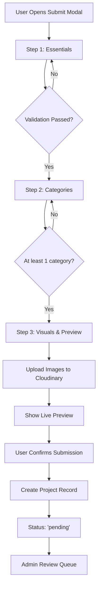
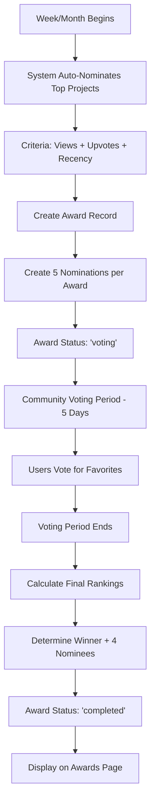
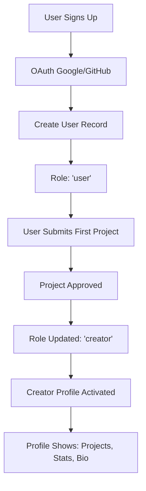

# AppGrade - Platform Documentation

## 📋 Table of Contents
- [Overview](#overview)
- [Database Schema](#database-schema)
- [System Workflows](#system-workflows)
- [API Architecture](#api-architecture)
- [Frontend Structure](#frontend-structure)

---

## 🎯 Overview

**AppGrade** is a platform for discovering, submitting, and awarding exceptional web applications and digital products. The platform features:
- Project submissions and discovery
- Weekly/monthly awards system
- Creator profiles and portfolios
- Community voting and engagement
- Search and filtering capabilities

---

## 🗄️ Database Schema

### Core Tables

#### 1. **users**
Stores user account information and authentication data.

| Column | Type | Description |
|--------|------|-------------|
| `id` | UUID | Primary key |
| `email` | VARCHAR(255) | Unique email address |
| `username` | VARCHAR(50) | Unique username |
| `display_name` | VARCHAR(100) | Public display name |
| `avatar_url` | TEXT | Profile picture URL |
| `bio` | TEXT | User biography |
| `website` | VARCHAR(255) | Personal website |
| `google_id` | VARCHAR(255) | Google OAuth ID (nullable) |
| `github_id` | VARCHAR(255) | GitHub OAuth ID (nullable) |
| `role` | ENUM | 'user', 'creator', 'admin' |
| `is_verified` | BOOLEAN | Email verification status |
| `created_at` | TIMESTAMP | Account creation date |
| `updated_at` | TIMESTAMP | Last update timestamp |

**Indexes:**
- `idx_users_email` on `email`
- `idx_users_username` on `username`
- `idx_users_google_id` on `google_id`
- `idx_users_github_id` on `github_id`

---

#### 2. **projects**
Main table for submitted applications/websites.

| Column | Type | Description |
|--------|------|-------------|
| `id` | UUID | Primary key |
| `creator_id` | UUID | Foreign key → users.id |
| `name` | VARCHAR(100) | Project name |
| `tagline` | VARCHAR(60) | Short description |
| `description` | TEXT | Full description (max 500 chars) |
| `website_url` | VARCHAR(255) | Live project URL |
| `logo_url` | TEXT | Project logo (Cloudinary URL) |
| `cover_image_url` | TEXT | Cover image (16:10 ratio) |
| `video_url` | TEXT | Demo video URL (optional) |
| `status` | ENUM | 'draft', 'pending', 'approved', 'rejected' |
| `submission_date` | TIMESTAMP | When submitted |
| `approval_date` | TIMESTAMP | When approved (nullable) |
| `views_count` | INTEGER | Total views |
| `upvotes_count` | INTEGER | Total upvotes |
| `created_at` | TIMESTAMP | Record creation |
| `updated_at` | TIMESTAMP | Last update |

**Indexes:**
- `idx_projects_creator` on `creator_id`
- `idx_projects_status` on `status`
- `idx_projects_submission_date` on `submission_date`

**Relationships:**
- `creator_id` → `users.id` (Many-to-One)

---

#### 3. **categories**
Predefined categories for projects.

| Column | Type | Description |
|--------|------|-------------|
| `id` | UUID | Primary key |
| `name` | VARCHAR(50) | Category name |
| `slug` | VARCHAR(50) | URL-friendly slug |
| `description` | TEXT | Category description |
| `icon` | VARCHAR(50) | Icon identifier |
| `created_at` | TIMESTAMP | Record creation |

**Default Categories:**
- Productivity
- Design
- Development
- Marketing
- Finance
- Social
- Entertainment
- Education
- Health
- Business
- Utilities
- Communication

---

#### 4. **project_categories**
Junction table for many-to-many relationship between projects and categories.

| Column | Type | Description |
|--------|------|-------------|
| `id` | UUID | Primary key |
| `project_id` | UUID | Foreign key → projects.id |
| `category_id` | UUID | Foreign key → categories.id |
| `created_at` | TIMESTAMP | Record creation |

**Indexes:**
- `idx_project_categories_project` on `project_id`
- `idx_project_categories_category` on `category_id`
- Unique constraint on (`project_id`, `category_id`)

---

#### 5. **awards**
Award categories and periods.

| Column | Type | Description |
|--------|------|-------------|
| `id` | UUID | Primary key |
| `title` | VARCHAR(100) | Award name |
| `slug` | VARCHAR(100) | URL-friendly slug |
| `description` | TEXT | Award description |
| `period_type` | ENUM | 'weekly', 'monthly' |
| `period_start` | DATE | Period start date |
| `period_end` | DATE | Period end date |
| `status` | ENUM | 'active', 'voting', 'completed' |
| `created_at` | TIMESTAMP | Record creation |

**Award Types:**
1. Site of the Week
2. People's Choice Award
3. Rising Designer Award
4. Most Innovative Concept
5. Most Improved Design
6. Site of the Month

---

#### 6. **award_nominations**
Projects nominated for specific awards.

| Column | Type | Description |
|--------|------|-------------|
| `id` | UUID | Primary key |
| `award_id` | UUID | Foreign key → awards.id |
| `project_id` | UUID | Foreign key → projects.id |
| `nomination_type` | ENUM | 'auto', 'admin', 'community' |
| `votes_count` | INTEGER | Total votes received |
| `is_winner` | BOOLEAN | Winner status |
| `rank` | INTEGER | Final ranking (1-5) |
| `created_at` | TIMESTAMP | Nomination date |

**Indexes:**
- `idx_nominations_award` on `award_id`
- `idx_nominations_project` on `project_id`
- `idx_nominations_votes` on `votes_count`

---

#### 7. **votes**
User votes for award nominations.

| Column | Type | Description |
|--------|------|-------------|
| `id` | UUID | Primary key |
| `user_id` | UUID | Foreign key → users.id |
| `nomination_id` | UUID | Foreign key → award_nominations.id |
| `created_at` | TIMESTAMP | Vote timestamp |

**Indexes:**
- `idx_votes_user` on `user_id`
- `idx_votes_nomination` on `nomination_id`
- Unique constraint on (`user_id`, `nomination_id`)

---

#### 8. **upvotes**
User upvotes for projects (general appreciation).

| Column | Type | Description |
|--------|------|-------------|
| `id` | UUID | Primary key |
| `user_id` | UUID | Foreign key → users.id |
| `project_id` | UUID | Foreign key → projects.id |
| `created_at` | TIMESTAMP | Upvote timestamp |

**Indexes:**
- `idx_upvotes_user` on `user_id`
- `idx_upvotes_project` on `project_id`
- Unique constraint on (`user_id`, `project_id`)

---

#### 9. **comments**
User comments on projects.

| Column | Type | Description |
|--------|------|-------------|
| `id` | UUID | Primary key |
| `user_id` | UUID | Foreign key → users.id |
| `project_id` | UUID | Foreign key → projects.id |
| `parent_id` | UUID | Foreign key → comments.id (nullable, for replies) |
| `content` | TEXT | Comment text |
| `likes_count` | INTEGER | Comment likes |
| `created_at` | TIMESTAMP | Comment timestamp |
| `updated_at` | TIMESTAMP | Last edit timestamp |

---

#### 10. **follows**
User following relationships.

| Column | Type | Description |
|--------|------|-------------|
| `id` | UUID | Primary key |
| `follower_id` | UUID | Foreign key → users.id (who follows) |
| `following_id` | UUID | Foreign key → users.id (being followed) |
| `created_at` | TIMESTAMP | Follow timestamp |

**Indexes:**
- `idx_follows_follower` on `follower_id`
- `idx_follows_following` on `following_id`
- Unique constraint on (`follower_id`, `following_id`)

---

## 🔄 System Workflows

### 1. Project Submission Flow



**Detailed Steps:**

**Step 1: Essentials**
- User fills: Name (required, max 50 chars)
- Tagline (required, max 60 chars, can select up to 4 suggestions)
- Description (required, max 500 chars)
- Website URL (optional, validated)

**Step 2: Categories**
- User selects 1+ categories from 12 predefined options
- Can add custom categories
- Categories saved to `project_categories` junction table

**Step 3: Visuals & Preview**
- Upload logo (optional)
- Upload cover image (optional, 16:10 ratio recommended)
- Add video URL (optional, YouTube/Vimeo)
- See live preview of how project will appear
- Images uploaded to Cloudinary, URLs stored in database

**Backend Processing:**
```sql
-- 1. Create project record
INSERT INTO projects (id, creator_id, name, tagline, description, website_url, 
                      logo_url, cover_image_url, video_url, status)
VALUES (uuid_generate_v4(), $1, $2, $3, $4, $5, $6, $7, $8, 'pending');

-- 2. Link categories
INSERT INTO project_categories (project_id, category_id)
VALUES ($project_id, $category_id);

-- 3. Notify admins for review
```

---

### 2. Award Selection Process



**Auto-Nomination Algorithm:**

```javascript
// Runs every Monday at 00:00 for weekly awards
// Runs on 1st of month at 00:00 for monthly awards

async function autoNominateProjects(awardType) {
  const periodStart = getPeriodStart(awardType); // Last 7 days or 30 days
  const periodEnd = new Date();
  
  // Scoring formula
  const query = `
    SELECT p.id, 
           (p.views_count * 0.3 + 
            p.upvotes_count * 0.5 + 
            EXTRACT(EPOCH FROM (NOW() - p.approval_date)) / 86400 * -0.2) as score
    FROM projects p
    WHERE p.status = 'approved'
      AND p.approval_date BETWEEN $1 AND $2
    ORDER BY score DESC
    LIMIT 30; -- Top 30 projects
  `;
  
  // Distribute top 30 across 6 award categories (5 per category)
  // Based on project characteristics and categories
}
```

**Voting Mechanics:**
- Each user can vote once per nomination
- Votes counted in real-time
- Final ranking based on vote count
- Highest votes = Winner
- Next 4 = Nominees

---

### 3. Creator Profile System



**Creator Profile Data:**

```sql
-- Creator profile view combines multiple tables
SELECT 
  u.id,
  u.username,
  u.display_name,
  u.avatar_url,
  u.bio,
  u.website,
  COUNT(DISTINCT p.id) as total_projects,
  SUM(p.views_count) as total_views,
  SUM(p.upvotes_count) as total_upvotes,
  COUNT(DISTINCT an.id) FILTER (WHERE an.is_winner = true) as awards_won,
  COUNT(DISTINCT f.follower_id) as followers_count,
  COUNT(DISTINCT f2.following_id) as following_count
FROM users u
LEFT JOIN projects p ON u.id = p.creator_id AND p.status = 'approved'
LEFT JOIN award_nominations an ON p.id = an.project_id
LEFT JOIN follows f ON u.id = f.following_id
LEFT JOIN follows f2 ON u.id = f2.follower_id
WHERE u.id = $1
GROUP BY u.id;
```

**Creator Stats Displayed:**
- Total Projects
- Total Views
- Total Upvotes
- Awards Won
- Followers
- Following

---

## 🏗️ API Architecture

### Authentication Endpoints

```
POST   /api/auth/google          - Google OAuth login
POST   /api/auth/github          - GitHub OAuth login
GET    /api/auth/me              - Get current user
POST   /api/auth/logout          - Logout user
```

### Project Endpoints

```
GET    /api/projects             - List projects (with filters)
GET    /api/projects/:id         - Get single project
POST   /api/projects             - Create project (auth required)
PUT    /api/projects/:id         - Update project (auth required, owner only)
DELETE /api/projects/:id         - Delete project (auth required, owner only)
POST   /api/projects/:id/upvote  - Upvote project (auth required)
DELETE /api/projects/:id/upvote  - Remove upvote (auth required)
```

### Award Endpoints

```
GET    /api/awards               - List all awards
GET    /api/awards/:id           - Get award details with nominations
GET    /api/awards/current       - Get current active awards
POST   /api/awards/:id/vote      - Vote for nomination (auth required)
```

### User/Creator Endpoints

```
GET    /api/users/:username      - Get user profile
GET    /api/users/:id/projects   - Get user's projects
POST   /api/users/:id/follow     - Follow user (auth required)
DELETE /api/users/:id/follow     - Unfollow user (auth required)
```

### Search Endpoints

```
GET    /api/search               - Search projects
  Query params:
    - q: search query
    - category: filter by category
    - sort: 'popular', 'recent', 'trending'
    - page: pagination
```

---

## 🎨 Frontend Structure

### Feature Modules

#### **Home** (`/`)
- Hero section
- Featured projects grid
- Filter bar (categories, search)
- Trending projects
- Recently added

#### **Awards** (`/awards`)
- Awards showcase (stacked cards animation)
- 6 award categories
- Winners display
- Nominees carousel for each category
- Voting interface (when active)

#### **Creators** (`/creators`)
- Creator directory
- Top creators leaderboard
- Creator cards with stats
- Follow functionality

#### **Profile** (`/profile/:username`)
- User information
- Projects portfolio
- Awards won
- Followers/Following
- Settings modal (own profile only)

#### **Submit** (`/submit`)
- Multi-step form modal
  - Step 1: Essentials
  - Step 2: Categories
  - Step 3: Visuals & Preview
- Real-time validation
- Image upload (Cloudinary)
- Live preview

#### **Search** (`/search`)
- Search bar
- Filters (categories, date, popularity)
- Results grid
- Sorting options

---

## 📊 Business Logic

### Project Approval Workflow

```javascript
// Admin reviews pending projects
async function reviewProject(projectId, decision, adminId) {
  if (decision === 'approve') {
    await db.query(`
      UPDATE projects 
      SET status = 'approved', 
          approval_date = NOW() 
      WHERE id = $1
    `, [projectId]);
    
    // Check if creator role should be upgraded
    const projectCount = await getApprovedProjectCount(creatorId);
    if (projectCount === 1) {
      await upgradeToCreator(creatorId);
    }
    
    // Notify creator
    await sendNotification(creatorId, 'project_approved');
  } else {
    await db.query(`
      UPDATE projects 
      SET status = 'rejected' 
      WHERE id = $1
    `, [projectId]);
    
    // Notify creator with feedback
    await sendNotification(creatorId, 'project_rejected');
  }
}
```

### Trending Algorithm

```javascript
// Calculate trending score
function calculateTrendingScore(project) {
  const hoursSinceApproval = (Date.now() - project.approval_date) / (1000 * 60 * 60);
  const viewsPerHour = project.views_count / Math.max(hoursSinceApproval, 1);
  const upvotesPerHour = project.upvotes_count / Math.max(hoursSinceApproval, 1);
  
  // Decay factor (older projects get lower scores)
  const decayFactor = Math.exp(-hoursSinceApproval / 168); // 7 days half-life
  
  return (viewsPerHour * 0.4 + upvotesPerHour * 0.6) * decayFactor;
}
```

---

## 🔐 Security Considerations

1. **Authentication**
   - OAuth 2.0 (Google, GitHub)
   - JWT tokens for session management
   - HTTP-only cookies

2. **Authorization**
   - Role-based access control (user, creator, admin)
   - Project ownership verification
   - Admin-only endpoints protected

3. **Data Validation**
   - Input sanitization
   - SQL injection prevention (parameterized queries)
   - XSS protection
   - CSRF tokens

4. **Rate Limiting**
   - API endpoints: 100 requests/minute per IP
   - Voting: 1 vote per nomination per user
   - Upvoting: 1 upvote per project per user

---

## 📈 Analytics & Metrics

### Tracked Metrics

1. **Project Metrics**
   - Views (incremented on project page visit)
   - Upvotes (user engagement)
   - Comments count
   - Share count

2. **User Metrics**
   - Total projects submitted
   - Awards won
   - Followers gained
   - Engagement rate

3. **Platform Metrics**
   - Daily active users
   - Projects submitted per day
   - Voting participation rate
   - Category popularity

---

## 🚀 Deployment Architecture

```
┌─────────────────┐
│   Cloudflare    │  CDN & DDoS Protection
└────────┬────────┘
         │
┌────────▼────────┐
│   Frontend      │  React + Vite (Vercel/Netlify)
│   (Client)      │
└────────┬────────┘
         │
┌────────▼────────┐
│   Backend API   │  Node.js + Express (Railway/Render)
│   (Server)      │
└────────┬────────┘
         │
    ┌────┴────┐
    │         │
┌───▼───┐ ┌──▼──────┐
│MongoDB│ │Cloudinary│  Database & Image Storage
└───────┘ └─────────┘
```

---

## 📝 Environment Variables

### Client (.env)
```
VITE_API_URL=http://localhost:5000
VITE_GOOGLE_CLIENT_ID=your_google_client_id
VITE_GITHUB_CLIENT_ID=your_github_client_id
```

### Server (.env)
```
PORT=5000
MONGODB_URI=mongodb://localhost:27017/appgrade
JWT_SECRET=your_jwt_secret
GOOGLE_CLIENT_ID=your_google_client_id
GOOGLE_CLIENT_SECRET=your_google_client_secret
GITHUB_CLIENT_ID=your_github_client_id
GITHUB_CLIENT_SECRET=your_github_client_secret
CLOUDINARY_CLOUD_NAME=your_cloud_name
CLOUDINARY_API_KEY=your_api_key
CLOUDINARY_API_SECRET=your_api_secret
CLIENT_URL=http://localhost:5173
```

---

## 🎯 Future Enhancements

1. **Collections** - Users can create curated collections of projects
2. **Badges** - Achievement system for creators
3. **Premium Tier** - Featured listings, analytics dashboard
4. **API for Developers** - Public API for third-party integrations
5. **Mobile App** - Native iOS/Android apps
6. **Newsletter** - Weekly digest of top projects
7. **Webhooks** - Real-time notifications for project events

---

**Last Updated:** November 2025  
**Version:** 1.0.0
